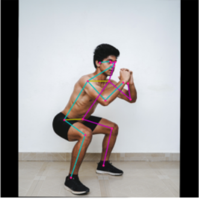

 

# Google Summer of Code'21 Final Report

**Organization: [TensorFlow](https://github.com/tensorflow/tensorflow)**

**Sub-Organization: [TensorFlow Lite](https://github.com/tensorflow/tflite-support)**

**Project: [Generate a new Task Library in TensorFlow Lite for Pose Landmark Detection](https://github.com/tensorflow/tflite-support/tree/master/tensorflow_lite_support/cc/task/vision)**

**Mentors: [Lu Wang](https://www.linkedin.com/in/lu-wang-21619a31/), [Meghna Natraj](https://www.linkedin.com/in/meghnanatraj/) and [George Soloupis](https://www.linkedin.com/in/george-soloupis/)**

## Abstract

In May of 2021, I was selected for Google Summer of Code'21 to work with TensorFlow. TensorFlow is an end-to-end open-source platform for machine learning. It has a comprehensive, flexible ecosystem of tools, libraries, and community resources that lets researchers push the state-of-the-art ML model and developers easily build and deploy ML-powered applications. TensorFlow Lite is a set of tools that enables on-device machine learning inference using TensorFlow models on mobile, embedded, and IoT devices with low latency and small binary size.  

## Objective

TensorFlow Lite Task Library contains easy-to-use task-specific libraries that allow developers to easily build Android/iOS apps using TensorFlow Lite instead of writing tedious custom code. My project goals were to `Generate a new Task Library in TensorFlow Lite for Pose Landmark Detection,` making an existing Landmark detection model available to mobile developers via a consistent and easy-to-use Task API.

## Model Details

[Movenet](https://blog.tensorflow.org/2021/05/next-generation-pose-detection-with-movenet-and-tensorflowjs.html) is an ultra-fast and accurate pose detection model for getting 17 key points of a body. The model comes in two variants, Lightning and Thunder(Lightening is better than Thunder). The model is designed to be run in the browser or on devices using TF Lite in real-time, targeting movement/fitness activities.


 </img>


## Project Status

- [x]  Create C++ Task Library to support Pose Landmark Detection 
- [x]  Create C++ API
- [x]  Write Unit tests for the API
- [ ]  Create JAVA API
- [ ]  Build Demo example

## Example Usage of the API

An example of such model can be found at:
https://tfhub.dev/google/movenet/singlepose/lightning/4

```cc
LandmarkDetectorOptions options;
options.mutable_base_options()->mutable_model_file()->set_file_name(
    "/path/to/model.tflite");

// Create an LandmarkDetector instance from the options.
StatusOr<std::unique_ptr<LandmarkDetector>> landmark_detector_or =
    LandmarkDetector::CreateFromOptions(options);
// Check if an error occurred.
if (!landmark_detector_or.ok()) {
  std::cerr << "An error occurred during LandmarkDetector creation: "
            << landmark_detector_or.status().message();
  return;
}
std::unique_ptr<LandmarkDetector> landmark_detector =
    std::move(landmark_detector_or.value());

// Prepare FrameBuffer input from e.g. image RGBA data, width and height:
std::unique_ptr<FrameBuffer> frame_buffer =
    CreateFromRgbaRawBuffer(image_rgba_data, {image_width, image_height});

// Run inference:
StatusOr<LandmarkResult> result_or = landmark_detector->Detect(*frame_buffer);
// Check if an error occurred.
if (!result_or.ok()) {
  std::cerr << "An error occurred during detection: "
            << result_or.status().message();
  return;
}
LandmarkResult result = result_or.value();

// Example value for 'result':
//
// 
// landmarks {key_y : 0.31545776 key_x : 0.4260728 score : 0.70056206}
// landmarks {key_y : 0.29907033 key_x : 0.44246024 score : 0.6350124}
// landmarks {key_y : 0.3031672 key_x : 0.44655707 score : 0.24581124}
// ....
// landmarks {key_y : 0.27858606 key_x : 0.8685331 score : 0.6350124}
// landmarks {key_y : 0.9299859 key_x : 0.7128526 score : 0.9422764}
```

## Contrubutions


## Final Thoughts

I really enjoyed my time working with the TensorFlow team. I have learned a lot working on this project during the GSoC period. I would like to thank my mentors Lu, Meghna, and George for believing in me and helping me out whenever I got stuck. I would keep contributing to the project and the community with the things I have learned and would continue to learn. 

Lastly, I would like to thank Google for organizing such a great program.


## Reach Me

<p align="left">
  <a href="mailto:milind170799@gmail.com?subject = Hello from your GitHub README&body = Message"></a>
  <a href="https://www.linkedin.com/in/milind-thakur-17july99/"></a>
</p>


